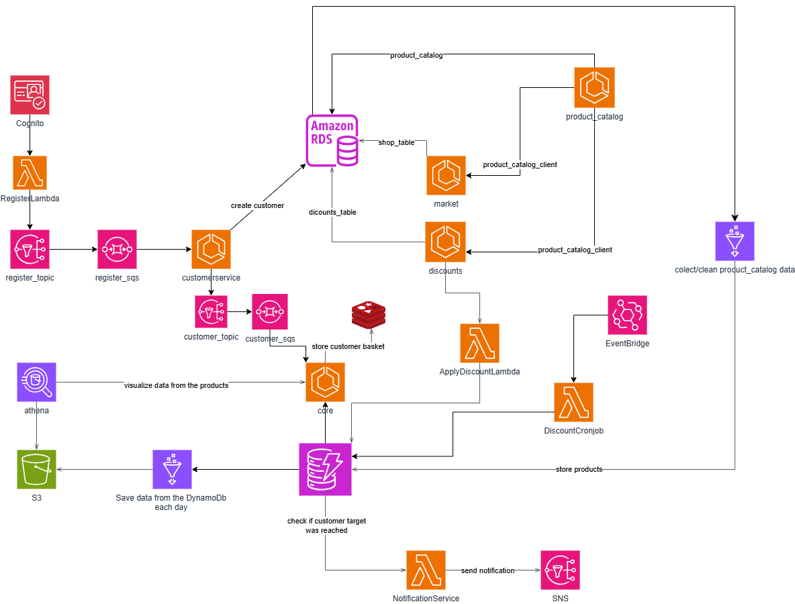

# 🛒 Petre Price Comparator

Welcome to the **Petre Price Comparator** — a scalable, event-driven price comparison platform built on AWS microservices architecture. This solution leverages multiple AWS services to compare product prices, apply discounts, notify users and track price evolution over time.



## 🚀 Overview

This project is a cloud-native backend system designed to:

- Collect and clean product catalog data.
- Register and manage customers.
- Store customer baskets and product information.
- Apply discounts based on usage.
- Visualize and store product data daily.
- Notify customers when specific thresholds or discounts are reached.

## 🧱 Architecture Components

### AWS Services Used

- **Amazon Cognito** – User authentication.
- **AWS Lambda** – Handles business logic (e.g., `RegisterLambda`, `ApplyDiscountLambda`, `DiscountCronJob`).
- **Amazon RDS** – Stores structured data (e.g., shop, customer, discount tables).
- **Amazon DynamoDB** – Stores fast-access customer and product information.
- **Amazon S3** – Stores visualized product data.
- **Amazon SQS & SNS** – Managing asynchronous communication.
- **Amazon EventBridge** – Triggers data collection and discount evaluation.
- **AWS Glue** – ETL job for moving data from RDS to DynamoDB and from DynamoDb to S3.
- **Amazon Athena** – Queries and visualizes product price evolution.

### Core Modules

- **Register Service**
  - Handles customer registration.
  - Uses Cognito and RegisterLambda, `register_sqs` SQS and `register_sns` SNS topic.

- **Customer Service**
  - Stores new customer data in RDS.
  - Publishes messages to `customer_topic`.

- **Product Catalog**
  - Stores product data and interacts with market and discount services via `pc_client`.

- **Discount System**
  - Applies discounts using the `ApplyDiscountLambda`.
  - An **EventBridge rule** and DiscountCronjob Lambda are triggered daily to check if any discounts have expired and updates the system accordingly.

- **Analytics and Storage**
  - Uses Athena to query and visualize the **price evolution** of products.
  - Data is stored daily into S3 for long-term analysis.

- **Notifications**
  - If a customer's discount target is reached, a notification is sent via SMS using SNS.

## 🧑‍💻 Getting Started

### Prerequisites

- AWS Account with appropriate permissions.
- Java with Spring Boot and Maven.
- Docker.
- Terraform.
- AWS CLI configured.

### Clone the Repository

```bash
git clone https://github.com/petre007/Petre-Price-Comparator.git
cd Petre-Price-Comparator
